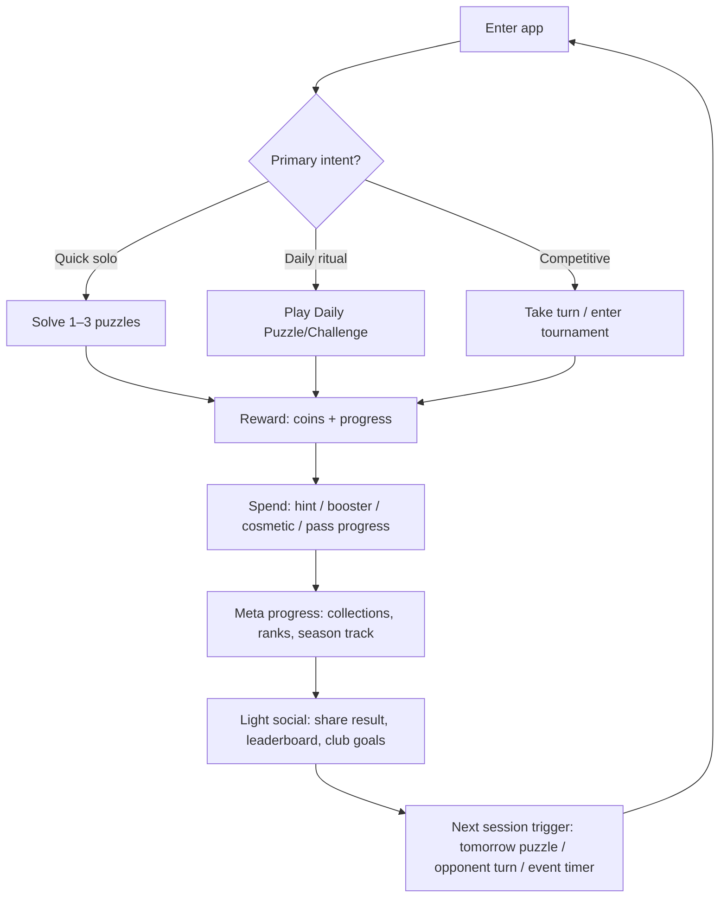
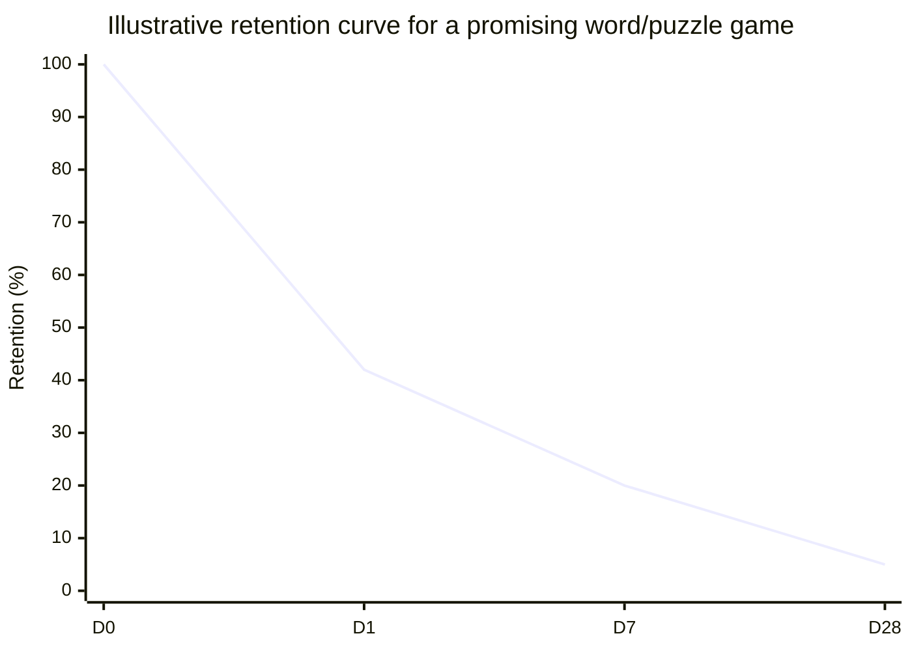

# Success Factors for Mobile Word Game Apps

## Navigation
- [Executive Summary](#executive-summary)
- [Word game market dynamics and subgenre taxonomy](#word-game-market-dynamics-and-subgenre-taxonomy)
- [Comparative landscape of top apps and design patterns](#comparative-landscape-of-top-apps-and-design-patterns)
- [Core success factors in word games](#core-success-factors-in-word-games)
- [Retention strategies and LiveOps patterns used by top apps](#retention-strategies-and-liveops-patterns-used-by-top-apps)
- [Monetization, analytics, and experimentation](#monetization-analytics-and-experimentation)
- [Audio, production polish, and accessibility best practices](#audio-production-polish-and-accessibility-best-practices)

## Executive Summary
Successful mobile word games combine an immediately legible core mechanic with long-term “reasons to return” that are compatible with short, repeatable sessions. In practice, the most durable titles tend to excel at five interlocking areas: (1) a low-friction first win and clear early value, (2) a difficulty curve that maintains a challenge–skill balance, (3) meta-progression that adds variety without bloating cognitive load, (4) retention scaffolding through daily/weekly cadence (goals, events, competitions, streaks), and (5) a monetization model that doesn’t break the relaxation/fairness contract players expect from word puzzles. [1]
Industry benchmark data underscores why the “first session” and “first week” matter so disproportionately: top-performing mobile games cluster around strong Day 1 retention (often cited as ~35%+ as a “healthy” threshold; with ~40%+ “doing really well”), while Day 7 and Day 28 retention rapidly drop, making early engagement and repeatable loops decisive. [1]
The most resilient word-game leaders also pair their puzzle loop with “lightweight social”: asynchronous matches, clubs, weekend tournaments, or score sharing/leaderboards that externalize motivation without requiring real-time coordination. This pattern is explicit in long-running multiplayer word games and in the modern daily-puzzle ecosystem that formalizes sharing rituals (leaderboards, daily wins) and expands into broader portfolios. [2]
Audio, animation, and UI feedback are not cosmetic—platform guidance and HCI research indicate multimodal feedback (visual + sound + haptics) improves clarity of state changes and can improve perceived experience (including perceived performance), while accessibility best practices require that core information not depend on audio alone. [3]
## Word game market dynamics and subgenre taxonomy
Word games occupy a rare sweet spot: they’re cognitively engaging but nonviolent, easy to play one-handed, and naturally compatible with “micro-sessions.” Benchmark reports that slice engagement by genre regularly place word/board/puzzle among the more “sticky” categories (high DAU/MAU), consistent with repeatable daily play. [4]
A practical taxonomy for mobile word games is below. The “what stands out” notes focus on recurring design patterns observed in successful titles (including the exemplars requested), and how they typically monetize and retain.
Asynchronous competitive word board (Scrabble-like / territory control).
The winning pattern is turn-based social obligation plus tactical depth: your opponent creates a naturally occurring open loop (“it’s your turn”), while the board state creates strategic stakes that feel earned rather than random. These games frequently layer clubs, seasonal ladders, and daily goals on top of the core duel loop to increase return frequency. [5]
Level-based anagram / word-connect (“letter wheel” / swipe-to-form) puzzles.
Leaders in this subgenre lean on: (a) extremely fast recognition of the mechanic, (b) large content volume (“thousands of levels”), and (c) meta-collecting/live events to prevent repetition fatigue. Monetization tends to be hybrid: ads + IAP (hints, currency, ad removal), with live events producing additional sinks and reasons to spend. [6]
Daily limited-attempt deduction puzzles (Wordle-like).
The core pattern is scarcity + ritual + social sharing: one puzzle per day constrains total playtime, reduces burnout, and makes sharing socially acceptable (“everyone did the same puzzle”). A large ecosystem of variants demonstrates how extensible this loop is across languages and rule tweaks. [7]
Crossword hybrids (word + jigsaw + trivia/theme).
These succeed by reducing the intimidation factor of clue-heavy crosswords while preserving the pleasure of “theme resolution.” Community content creation (users making puzzles) is a particularly strong lever here: it increases content supply and builds identity (“I made a puzzle”). [8]
Word search / hidden-word scanners.
The winning pattern is relaxation and fluency: low cognitive friction, satisfying scanning, and frequent small wins. Monetization often relies more heavily on ads and cosmetic/collection layers than on deep IAP.
Word battle “minigames” inside a broader word hub.
Some older brands evolve into multi-mode platforms: solo challenges, lightning duels, daily modes, pass tracks, and clubs. This increases audience reach (different motivations) but raises the risk of feature bloat and perceived “freemium trap” if complexity outpaces value. [9]
Adversarial / novelty variants (e.g., “the game fights back”).
These succeed mostly as shareable curiosities rather than long-lived services: the hook is novelty and identity (“I beat the evil version”). [10]
## Comparative landscape of top apps and design patterns
The table below compares a set of major word games across core loop, monetization, and retention scaffolding. “Session length” and DAU/MAU are often not publicly disclosed at a per-title level; when unavailable, entries use either store-stated play patterns or clearly marked estimates.
App	Primary subgenre	Core loop	Monetization model	Retention tactics observed	Social/competitive features	Session model (typical)	DAU/MAU or scale signals (if available)
Words With Friends[11]
Async word board / multi-mode hub	Take a turn → score/optimize tiles → wait for opponent/daily modes → repeat [12]
Hybrid: ads + IAP; seasonal “Rewards Pass” with free/premium tracks (4-week seasons) [13]
Daily goal streaks; multi-mode daily play; pass progression; clubs with shared goals [14]
Clubs; async matches; additional competitive modes [15]
Turns are “snackable,” but multi-game concurrency can extend play (estimate: ~2–10 min per visit depending on active games)	GDC talk notes “multiple tens of millions of users” across With Friends games [16]

Wordscapes[17]
Level-based word connect + heavy LiveOps	Solve level → earn currency/resources → unlock/advance collections/events → repeat [18]
Hybrid: IAP + ads; extra “ad removal” options appear in release notes; event currencies and sinks [19]
Daily puzzle (unique daily board + butterfly collection); weekly collection events; weekend tournaments with crowns [20]
Tournaments; (optionally) teams; competitive crown collection [21]
Store copy explicitly frames “10 mins a day” usage [22]
Sensor estimates (US, recent month): ~400k downloads and ~$2m revenue (est.) [23]

Wordle[24]
Daily limited-attempt deduction	One daily puzzle → 6 guesses → share/compare → return tomorrow [25]
Initially free after joining NYT Games; NYT uses games portfolio and subscriptions more broadly (Wordle acquisition low-seven figures; remained free at move) [26]
Daily ritual; social sharing; portfolio cross-pollination (Wordle brought “tens of millions” of people into NYT audience per NYT CFO quote) [26]
Social sharing; later, multi-game leaderboard for friends/“puzzle people” [27]
Intentionally bounded (estimate: ~1–10 min/day)	Impact signal: “tens of millions” of new audience members attributed to acquisition, driving subscriptions [28]

Letterpress[29]
Competitive territory-control word board	Find word → claim tiles → contest territory → repeat until board resolves [30]
Freemium (currently positioned as free across platforms) [30]
Long-term retention tends to come from rematches, stats, and social competition rather than heavy LiveOps (inference from feature set) [30]
Real-time play, bots, chat, stats/leaderboards; group play [30]
Short match bursts (estimate: ~3–15 min)	No public DAU/MAU located in primary sources reviewed
Word Cookies[31]
Level-based word connect	Swipe letters → discover target words → progress through large level map [32]
Ads + IAP (coins/ad-free); ads include banners/interstitials/videos (variant listing) [33]
Massive level volume (“Over 30,000 levels”); “daily” light engagement implied; sessions shaped by level cadence [32]
Mostly solo; social is typically external (sharing) rather than structured modes (varies by regional build)	Short repeatable sessions; marathon potential due to level count	No reliable DAU/MAU located in primary sources reviewed
Bonza Word Puzzle[34]
Crossword-jigsaw-trivia hybrid	Reassemble themed fragments → complete puzzle → do daily/community puzzles → repeat [35]
Typically puzzle-pack and/or IAP driven; positioned around daily puzzles + UGC (store descriptions emphasize daily/community) [36]
Daily puzzles; community-designed puzzles; puzzle creator feature [37]
“Challenge friends” via custom puzzles (light social) [36]
Daily puzzle supports a short ritual; packs enable longer sessions	No reliable DAU/MAU located in primary sources reviewed
## Core success factors in word games
A successful mobile word game is best understood as a system that repeatedly converts language effort into felt progress. The best products reduce friction in the language effort (input, legibility, dictionary clarity) and amplify felt progress via feedback, pacing, and meta-structure.
### Gameplay mechanics that scale
Mechanics must satisfy three properties:
Instant comprehension.
Players should be able to predict what the game wants within a few seconds (e.g., turn-based tile placement, swipe letters to form words, or limited guesses with color feedback). This is the core reason word-connect and daily-guess formats propagate quickly: the rule explanation is almost the UI. [38]
Low motor friction + high cognitive reward.
Touch interactions should be “forgiving”: generous hit targets, undo, and fast word validation. The reward is cognitive (“I found it!”), so input should not be the challenge.
Fairness and trust.
Word games are unusually sensitive to perceived unfairness: dictionary disputes, obscure allowed words, or inconsistent validation can break the feeling of competence. Long-running board-style games explicitly document placement and scoring rules to reduce ambiguity. [12]
### Difficulty curve and the flow problem
A durable word game maintains challenge without trapping players in shame/frustration. Two research-backed lenses are particularly actionable:
Challenge–skill balance (flow): puzzle games can induce “urge to keep playing” when players perceive an appropriate balance between puzzle challenge and their skill/expertise. [39]
Need satisfaction (self-determination theory): autonomy, competence, and relatedness independently predict enjoyment and future play in games. Word games can support competence (clear feedback, mastery), autonomy (choice of mode/pace), and relatedness (friends/clubs). [40]
In practical tuning terms:
•	Early levels should be “generous” to establish competence fast; benchmark commentary implies Day 1 retention thresholds are brutal, and low Day 1 is commonly interpreted as a core-loop problem. [4]
•	Midgame must introduce new decisions, not just harder vocabulary: time pressure, board constraints, variable goals, special tiles, or different puzzle templates. “Perfect your in-game core loop” and unlock new content by Day 7 is explicitly called out in benchmarking guidance. [4]
•	Late game requires an “endgame” (daily challenges, PvP, leaderboards, collections), because content depth alone eventually saturates. [41]
### Progression systems that don’t exhaust players
Word games that last for years often separate progression into two layers:
Puzzle progression: levels, daily puzzles, challenge modes.
Meta progression: collections, cosmetics, ranks, seasonal crowns, pass tracks, habitats/portraits, etc.
This structure is visible in modern leaders: daily puzzles with collectible elements, weekly portrait/butterfly collection events, and weekend tournaments that award crown progress—layers that give meaning to “just another puzzle.” [20]
Similarly, a seasonal pass system converts diverse daily modes and goals into a single progress track with free/premium tiers and fixed season length. [42]
A key best practice is keeping meta rewards adjacent to word mastery: cosmetics, profile identity, and mild boosters work because they enhance rather than replace the competence fantasy.
### Onboarding that earns permission to go deeper
Mobile retention data increasingly frames early minutes as decisive: “If value isn’t clear in the first 5–15 minutes, players churn.” [43]
For word games, “value” is typically one of:
•	I feel smart quickly (first win in <60 seconds).
•	I see a long runway (map/level count, daily puzzle tomorrow).
•	I feel invited into a ritual/community (share, friends, clubs). [44]
A useful mental model is: teach only what’s required to get to the first satisfying solve, then progressively disclose meta systems in the next 1–3 sessions.
### Designing a strong hook and an enjoyable loop
A strong hook is not “one trick.” It’s a sequence of psychological conversions: curiosity → competence → commitment.
#### Psychological levers that word games can use ethically
Competence loops (mastery and feedback).
Word games are naturally competence-forward; the design job is to make that competence visible. Color/position feedback, scoring multipliers, streak stats, and clean “win state” animations all externalize progress. Competence is a core predictor of future play in games research. [45]
Autonomy via mode choice.
A single app that supports solo play, daily puzzles, and competitive modes can capture broader motivations, especially when players can self-select intensity. [46]
Relatedness and social proof.
The modern daily puzzle ecosystem leans heavily on “shareable wins.” NYT explicitly describes building a multi-game leaderboard because solvers already share scores in group chats and on social media, and the product aims to make connecting and celebrating daily wins easier. [47]
Bounded scarcity (anti-burnout).
A one-puzzle-per-day design can be a retention feature because it prevents overconsumption and turns play into a ritual. [25]
Open loops through asynchronous turns and streaks.
Asynchronous turn-taking creates natural “unfinished business.” Separately, streak systems can motivate daily repetition; popular consumer explanations and platform case studies note that streak counters create accountability even for very short daily sessions. [48]
Novelty via variants and constrained twists.
The scale of “Wordle-like” variants (hundreds across many languages) illustrates how minor rule changes can create new hooks (multi-grid, longer words, themes). [49]
### A canonical loop for a modern F2P word game

This loop structure mirrors the explicit “daily goals → rewards → streak bonus” approach in some multiplayer word games, and the daily puzzle + collectible layers in level-based word games. [50]
### Session pacing: the “three satisfactions” rule
In word games, an enjoyable session usually needs at least one of:
1.	A clear solve (closure).
2.	A near miss (“I almost had it” encourages retry without feeling cheated).
3.	A meta payoff (a chest, crown coin, portrait/butterfly, pass tier). [51]
The practical pacing tactic is to ensure each ~2–5 minute session hits one of these beats, while longer sessions chain them.
## Retention strategies and LiveOps patterns used by top apps
Retention in successful word games is rarely a single mechanic; it’s a calendar.
### Daily systems: goals, puzzles, streaks, and collection drip
Daily goals and streak bonuses are a direct way to increase visit frequency. Some word games explicitly structure daily goals across modes and grant a 7-day streak bonus. [52]
Daily puzzle systems create a ritual plus novelty (unique daily puzzle not found in normal progression), sometimes with additional collectible layers (e.g., butterflies on squares). [53]
Streak design must be handled carefully: streaks can motivate, but can also shift users from intrinsic to obligation-based engagement; consumer-facing scientific summaries emphasize streaks’ motivational pull. [54]
### Weekly cadence: tournaments, seasons, and “weekend spikes”
Weekend tournaments and seasonal crown collection are classic word-game retention scaffolds: players return when the competitive window is open, and the “seasonal” framing converts participation into an identity item (the crown next to your name). [55]
Seasonal passes formalize a four-week cadence with continuous scheduling and free/premium reward tracks driven by daily/weekly/seasonal goals. [56]
### Push notifications: high leverage, high risk
Industry benchmark research correlating push frequency with 90-day retention (63M new users) finds that users receiving daily-or-more pushes (“Daily+”) had the highest retention, and that receiving any push in the first 90 days correlates with ~3× higher retention vs. none—while also warning that many opted-in users never receive a push at all. [57]
Academic research on push in “gameful” contexts adds a caution: wording and frequency matter; qualitative results suggest highlighting value without being perceived as a sales tactic, and that additional messages can decrease efficiency. [58]
Best-practice implication for word games:
•	Ask for push permission only after the player experiences value (a “primer” message can help), then personalize by mode and habit (daily puzzle reminder vs. “your turn” vs. tournament ending). [59]
•	Use strict frequency caps and stop rules when pushes increase opt-outs/uninstalls.
### Social and competitive: “lightweight rivalry” scales
Long-running multiplayer word games formalize community through clubs (“find active opponents, shared goals, safe community”), which directly targets relatedness and matchmaking quality. [60]
In the daily puzzle ecosystem, leaderboards explicitly productize the “already happening” sharing behavior: users add friends and track daily scores across multiple puzzles, reinforcing both identity and repeat play. [61]
## Monetization, analytics, and experimentation
### Monetization models that fit word games
The monetization model must match the emotional promise. Word games often promise “relaxing challenge,” so monetization that feels like it blocks thinking (intrusive interstitials mid-flow, aggressive paywalls on core play) increases backlash risk—visible in user sentiment when formerly simple word games accumulate complex LiveOps and monetization layers. [62]
Common models and where they work:
Ads + IAP (hybrid).
Hybrid monetization has become a dominant pattern in mobile games broadly: benchmark reports emphasize publishers mixing in-app ads with IAP to diversify revenue. [63]
In word games, best practice is to keep forced ads out of the “thinking moment” and instead place them after closure (level end) or as opt-in rewards (watch to earn hints/coins).
Consumable IAP (hints, coins).
This fits because it sells friction reduction rather than power over others—especially important for fairness-sensitive word audiences. Platform benchmarking notes that conversion rates are typically low, so value communication and timing matter; examples include reactive offers when players are stuck or out of hints. [64]
Season passes / reward tracks.
A structured season (e.g., four weeks) converts cross-mode engagement into predictable revenue while giving non-payers an ongoing goal track. [56]
Subscription bundles (portfolio strategy).
Some publishers monetize the portfolio rather than the single puzzle, using hit games to bring users into a broader ecosystem (and then upsell subscriptions). The Wordle acquisition is explicitly framed as joining a larger games portfolio; subsequent earnings commentary attributes “tens of millions” of new audience members to the acquisition and notes subscription impacts. [26]
### The metrics that matter for word games
A rigorous analytics setup should track the funnel from first solve to habit formation and monetization, segmented by player type (solo-only, daily-ritual, social-competitive, long-session grinders).
Acquisition & activation - Install → first open → tutorial completion rate
- Time-to-first-solve / time-to-first-“felt win” (very often the best leading indicator for D1) [65]
- First-session puzzle completions and failure rate (difficulty calibration)
Retention & engagement - D1, D7, D28/D30 retention
- Benchmark guidance: top titles often sit ~35–50% (D1), ~15–25% (D7), and ~4–6% (D28), with word games cited around ~16% D7 in the benchmark report. [4]
- DAU/MAU (“stickiness”), sessions per DAU, average session length
- Word/board/puzzle are cited among top stickiness genres (>25%) in the same benchmark set. [4]
- Daily puzzle participation rate; streak distribution; reactivation after streak break
Economy & monetization - Ad engagement rate (opt-in rewarded videos) and ad-driven churn (uninstall after ad spike)
- IAP conversion rate, ARPPU, ARPDAU; offer take rates by segment [64]
- Pass adoption rate; completion rate of pass milestones; whether pass increases retention or merely monetizes existing loyalists
Social - Friend/club join rate; matches started per user; “your turn” response time; churn after social loss (opponent quits) [66]
### Suggested A/B tests and experiments to improve hook and retention
These experiments are framed to be measurable and directly tied to retention benchmarks and known risk points (early churn, repetition fatigue, notification opt-out).
Onboarding and early clarity - Experiment: “First win in 30 seconds” onboarding vs. “full tutorial first.”
Success metrics: Time-to-first-solve, D1 retention, tutorial skip rate.
Rationale: early value clarity within minutes is repeatedly emphasized. [65]
•	Experiment: Immediate “daily puzzle preview” at end of first session vs. delayed unlock Day 2.
Success metrics: Next-day return rate; daily puzzle adoption.
Rationale: daily ritual is a primary retention primitive. [67]
Difficulty and flow - Experiment: Adaptive hint prompting when failure probability spikes vs. fixed hint prompts.
Metrics: Level fail rate, hint usage, D7 retention, IAP conversion (if hints are monetized).
Rationale: retention correlates with avoiding boredom/frustration traps; dynamic difficulty research targets this “difficulty paradox.” [68]
LiveOps cadence - Experiment: Weekend tournament start time and duration variations (24h vs 48h window).
Metrics: Participation, session count, churn, ad/IAP lift during window.
Rationale: tournaments and seasonal rewards are proven return triggers. [55]
Push notification strategy - Experiment: Push “primer” after first meaningful win vs. system prompt on first open.
Metrics: Opt-in rate, push-enabled retention lift, opt-out/uninstall. [59]
•	Experiment: Behavioral segmentation (daily puzzle reminder only to daily puzzle adopters) vs. broadcast reminders.
Metrics: Notification open rate, session starts attributable to push, churn.
Rationale: frequency helps retention in aggregate, but relevance and perceived salesiness affect efficiency. [69]
### Retention benchmark chart and interpretation

The midpoint values (≈42% D1, ≈20% D7, ≈5% D28) reflect ranges cited for top-performing games in a large benchmark dataset; actual targets should be calibrated to your specific audience and UA mix. [4]
## Audio, production polish, and accessibility best practices
Word games are “feel” products: players spend most of their time in a thinking loop, and production quality strongly influences whether that loop feels calming, crisp, and trustworthy.
### Feedback design: sound and haptics as functional UX
Platform guidance emphasizes using feedback (color, text, sound, haptics) so users can perceive state changes even if they’re not looking at the screen or if the device is silenced—implying you should design redundant channels (not sound-only). [70]
Apple guidance for haptics stresses consistency and using system-appropriate patterns; Android guidance similarly recommends “less is more,” co-designing visuals/audio/haptics, and avoiding legacy buzzy vibrations. [71]
A WWDC design session explicitly teaches designing audio and haptics in harmony with interactive moments, which maps directly to word-game micro-feedback like letter placement, invalid word, and solve celebration. [72]
Concrete best practices for word games:
- Short, subtle confirmation sounds for letter placement and word acceptance; distinct but gentle error cues (invalid word, no moves). [73]
- Haptics only where they clarify a state change (tap/commit, reward claim), not continuously. [74]
- “Win” moments should be satisfying but not startling: many word games are played in quiet contexts (bed, commute).
### Music: support focus, don’t compete with cognition
Music in word games should typically be ambient, loopable, and low-attention, because heavy musical complexity competes with language processing. Provide robust audio controls (music/sfx sliders, mute) and remember that many users play with audio off; your game must still feel complete visually. Accessibility guidance explicitly recommends using haptics in addition to audio cues and ensuring information isn’t audio-dependent. [75]
### UI polish and animation: “clarity first” rules
Smooth micro-animations improve perceived quality by clarifying transitions and reducing cognitive effort; multimodal experience design guidance emphasizes harmonizing motion with audio/haptics for coherent feedback. [76]
However, research also suggests sound effects do not always improve objective task performance, which implies a pragmatic standard: add “juice” where it clarifies state, not as constant decoration. [77]
### Accessibility: requirements that matter in word games
Word games are text-heavy; accessibility is not optional if you want broad adoption.
High-impact practices:
- Subtitles/captions before sound plays if any tutorial or narrative uses audio; don’t trap users in an uncaptioned intro. [78]
- Color-blind safe feedback: do not rely solely on color to convey correctness or rarity; add shape/icons/pattern. (Platform guidance pushes redundant feedback channels.) [79]
- Scalable typography and readable contrast for letter tiles, rack, and clue text; word games fail catastrophically when letters aren’t legible. [80]
Finally, accessibility isn’t only ethical—it’s strategic. A larger reachable audience increases the ceiling on retention and monetization without resorting to more aggressive tactics.
### Production takeaway
A word game app’s “polish” is best measured by error recovery and state clarity: can a player always tell what happened, what changed, and what to do next—even with sound off, one-handed, and distracted? That standard is exactly what platform feedback guidance and multimodal design practices push developers toward. [81]
________________________________________
[1] [4] [11] [41] [64] https://public-production.gameanalytics.com/assets/GameAnalytics-Benchmarks-Report-2018.pdf
https://public-production.gameanalytics.com/assets/GameAnalytics-Benchmarks-Report-2018.pdf
[2] [5] [16] https://gdcvault.com/play/1015128/Words-With-Friends-Building-and
https://gdcvault.com/play/1015128/Words-With-Friends-Building-and
[3] [70] [79] [81] https://developer.apple.com/design/human-interface-guidelines/feedback
https://developer.apple.com/design/human-interface-guidelines/feedback
[6] [32] [38] https://apps.apple.com/de/app/word-cookies/id1153883316?l=en-GB
https://apps.apple.com/de/app/word-cookies/id1153883316?l=en-GB
[7] [25] [26] https://static.poder360.com.br/2022/01/NY-Times-Wordle-.pdf
https://static.poder360.com.br/2022/01/NY-Times-Wordle-.pdf
[8] [36] [37] https://apps.apple.com/us/app/bonza-word-puzzle/id662053009
https://apps.apple.com/us/app/bonza-word-puzzle/id662053009
[9] [46] https://www.zynga.com/games/words-with-friends-2/
https://www.zynga.com/games/words-with-friends-2/
[10] https://qntm.org/absurdle
https://qntm.org/absurdle
[12] https://zyngasupport.helpshift.com/hc/en/63-words-with-friends-2/faq/10552-words-with-friends-rule-book/
https://zyngasupport.helpshift.com/hc/en/63-words-with-friends-2/faq/10552-words-with-friends-rule-book/
[13] https://apps.apple.com/us/app/words-with-friends-word-game/id1196764367
https://apps.apple.com/us/app/words-with-friends-word-game/id1196764367
[14] [24] [50] [52] https://zyngasupport.helpshift.com/hc/en/63-words-with-friends-2/faq/21830-daily-puzzle-goals/?l=et&p=ios&s=community
https://zyngasupport.helpshift.com/hc/en/63-words-with-friends-2/faq/21830-daily-puzzle-goals/?l=et&p=ios&s=community
[15] [60] [66] https://www.zynga.com/corporate/clubs-101-the-essential-guide-to-words-with-friends-2s-newest-feature/
https://www.zynga.com/corporate/clubs-101-the-essential-guide-to-words-with-friends-2s-newest-feature/
[17] [62] https://apps.apple.com/au/app/wordscapes/id1207472156
https://apps.apple.com/au/app/wordscapes/id1207472156
[18] [22] https://play.google.com/store/apps/details?hl=en_US&id=com.peoplefun.wordcross
https://play.google.com/store/apps/details?hl=en_US&id=com.peoplefun.wordcross
[19] https://apps.apple.com/us/app/wordscapes-word-game/id1207472156
https://apps.apple.com/us/app/wordscapes-word-game/id1207472156
[20] [53] [67] https://peoplefun.helpshift.com/hc/en/6-wordscapes/faq/270-what-is-the-daily-puzzle-and-how-does-it-work/?p=ios
https://peoplefun.helpshift.com/hc/en/6-wordscapes/faq/270-what-is-the-daily-puzzle-and-how-does-it-work/?p=ios
[21] https://peoplefun.helpshift.com/hc/en/6-wordscapes/section/68-tournaments/
https://peoplefun.helpshift.com/hc/en/6-wordscapes/section/68-tournaments/
[23] https://app.sensortower.com/overview/1207472156?country=US
https://app.sensortower.com/overview/1207472156?country=US
[27] [29] [44] [47] [61] https://ttabvue.uspto.gov/ttabvue/ttabvue-91291631-OPP-14.pdf
https://ttabvue.uspto.gov/ttabvue/ttabvue-91291631-OPP-14.pdf
[28] https://www.reuters.com/business/media-telecom/new-york-times-misses-quarterly-revenue-estimates-2022-05-04/
https://www.reuters.com/business/media-telecom/new-york-times-misses-quarterly-revenue-estimates-2022-05-04/
[30] https://www.letterpressapp.com/
https://www.letterpressapp.com/
[31] [51] [55] https://peoplefun.helpshift.com/hc/en/6-wordscapes/faq/288-what-are-crowns/
https://peoplefun.helpshift.com/hc/en/6-wordscapes/faq/288-what-are-crowns/
[33] https://play.google.com/store/apps/details?hl=en_US&id=com.bitmango.go.wordcookiescross
https://play.google.com/store/apps/details?hl=en_US&id=com.bitmango.go.wordcookiescross
[34] [78] https://gameaccessibilityguidelines.com/ensure-subtitles-captions-are-or-can-be-turned-on-before-any-sound-is-played/
https://gameaccessibilityguidelines.com/ensure-subtitles-captions-are-or-can-be-turned-on-before-any-sound-is-played/
[35] https://play.google.com/store/apps/details?hl=en_US&id=air.au.com.minimega.bonza
https://play.google.com/store/apps/details?hl=en_US&id=air.au.com.minimega.bonza
[39] https://pmc.ncbi.nlm.nih.gov/articles/PMC8943660/
https://pmc.ncbi.nlm.nih.gov/articles/PMC8943660/
[40] [45] https://selfdeterminationtheory.org/SDT/documents/2006_RyanRigbyPrzybylski_MandE.pdf
https://selfdeterminationtheory.org/SDT/documents/2006_RyanRigbyPrzybylski_MandE.pdf
[42] [56] https://zyngasupport.helpshift.com/hc/en/63-words-with-friends-2/faq/16921-rewards-pass/
https://zyngasupport.helpshift.com/hc/en/63-words-with-friends-2/faq/16921-rewards-pass/
[43] [65] https://investgame.net/wp-content/uploads/2026/01/2026-01-20-Mobile_retention_benchmarks_2026.pdf
https://investgame.net/wp-content/uploads/2026/01/2026-01-20-Mobile_retention_benchmarks_2026.pdf
[48] https://blog.duolingo.com/how-duolingo-streak-builds-habit/
https://blog.duolingo.com/how-duolingo-streak-builds-habit/
[49] https://rwmpelstilzchen.gitlab.io/wordles
https://rwmpelstilzchen.gitlab.io/wordles
[54] https://www.scientificamerican.com/article/why-keeping-a-streak-boosts-your-motivation/
https://www.scientificamerican.com/article/why-keeping-a-streak-boosts-your-motivation/
[57] [69] https://grow.urbanairship.com/rs/313-QPJ-195/images/WP_App_Retention_Rates_Benchmarks.pdf
https://grow.urbanairship.com/rs/313-QPJ-195/images/WP_App_Retention_Rates_Benchmarks.pdf
[58] https://eprints.bournemouth.ac.uk/38820/1/Kunkel%2C%20Hayduk%2C%20%26%20Lock%20%282023%29%20Push%20it%20real%20good.pdf
https://eprints.bournemouth.ac.uk/38820/1/Kunkel%2C%20Hayduk%2C%20%26%20Lock%20%282023%29%20Push%20it%20real%20good.pdf
[59] https://www.braze.com/resources/articles/push-notifications-best-practices
https://www.braze.com/resources/articles/push-notifications-best-practices
[63] https://tenjin.com/blog/ad-monetization-benchmark-report-2025-ecpm-ad-revenue/
https://tenjin.com/blog/ad-monetization-benchmark-report-2025-ecpm-ad-revenue/
[68] https://emergingsociety.org/index.php/efltajet/article/download/47/46
https://emergingsociety.org/index.php/efltajet/article/download/47/46
[71] https://developer.apple.com/design/human-interface-guidelines/playing-haptics
https://developer.apple.com/design/human-interface-guidelines/playing-haptics
[72] [76] https://developer.apple.com/videos/play/wwdc2021/10278/
https://developer.apple.com/videos/play/wwdc2021/10278/
[73] https://m2.material.io/design/sound/applying-sound-to-ui.html
https://m2.material.io/design/sound/applying-sound-to-ui.html
[74] https://developer.android.com/develop/ui/views/haptics/haptics-principles
https://developer.android.com/develop/ui/views/haptics/haptics-principles
[75] [80] https://developer.apple.com/design/human-interface-guidelines/accessibility
https://developer.apple.com/design/human-interface-guidelines/accessibility
[77] https://dl.acm.org/doi/fullHtml/10.1145/3491102.3517581
https://dl.acm.org/doi/fullHtml/10.1145/3491102.3517581
